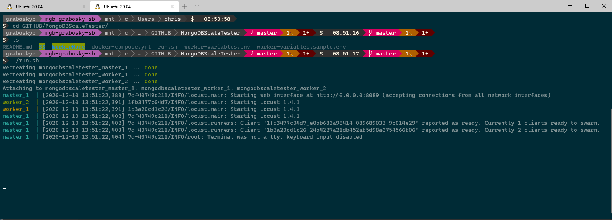
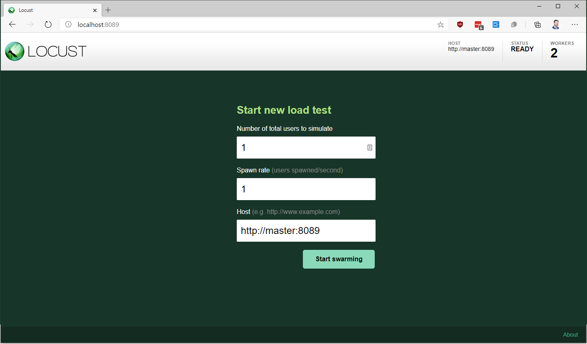
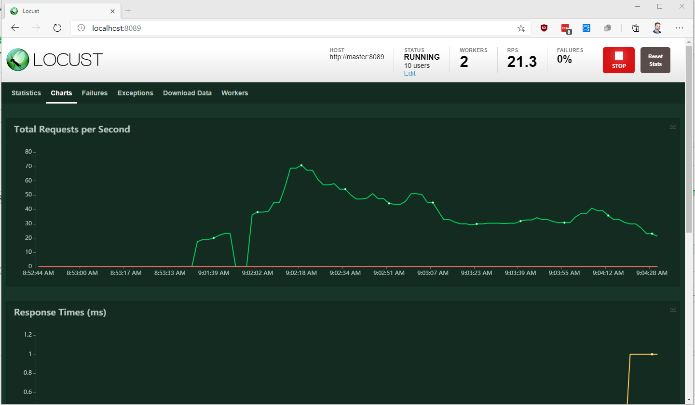

# Scale Tester

## About
This is a basic test suite load gen tester built on [locust.io](https://locust.io/)

## Use
### Prep
* Deploy an [Atlas](https://www.mongodb.com/cloud/atlas) cluster
* Create a username and password
* Add your IP address to your IP Access List
* Press the connect button and choose "Connect your Application" then "Python" and make note of the connection string for later

### Modifying load
* Edit [locustfile](WorkerNode/locustfile.py) and copy the one function in there to do whatever you want
    * Today this will create 11k docs with a random ID and binary payload and store them via upsert
* Use the `tag` directive for identifying the function within the Locust UI
* Use the `task` directive for task frequency (i.e. 2 will happen half as frequently as 1)
* Add any python packages to the requirements.txt file

### Container names
* The [build.sh](WorkerNode/build.sh) and [compose](docker-compose.yml) reference my DockerHub username. If you aren't me, change instances of `graboskyc`

### Building the container
* Locust uses the same container for the master and workers
* Run the [build.sh](WorkerNode/build.sh) in bash to create the containers locally. It will auto tag it with an auto-incrementing version number and latest tags

### Environment variables
* Copy the [worker-variables.sample.env](worker-variables.sample.env) to `worker-variables.env`
* modify the `MDBCONNSTRING` field with your [Atlas](https://www.mongodb.com/cloud/atlas) connection string

### Running the test
* Run the [run.sh](run.sh) and this will start the load test
* Hard coded in that script it will launch one `master` and 2 `workers` which you can modify in that script
* Open a web browser to `http://localhost:8089`

### Ending the test
* Return to console and press control+c to end the compose stack

## Results

